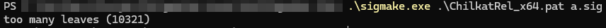
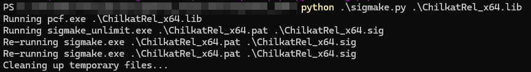

# Auto-sigmake

Automatic completion of sigmake, get the sig file for ida symbol production. It's good for large lib's sigmake.    
自动完成sigmake，获取sig文件用于ida符号制作。对于大型lib的符号制作非常有用。  

# What this project can do ?

Automatic execution pcf.exe and sigmake.exe.  
自动执行pcf.exe和sigmake.exe。

Automatically process the exc file, it will manually retain the different functions with the same signature bytecode. Here, retain the first function.   
自动处理exc文件，他会有手动保留相同特征码的不同函数的环节。这里保留第一个函数。  

Patch 9.1 flair's sigmake.exe, original sigmake has leaves limit when process pat file.  
Patch 9.1 flair的sigmake.exe，原始程序在处理pat文件时有处理数量限制。  

# Usage
python.exe (file.lib or file.pat) name.sig  
  

